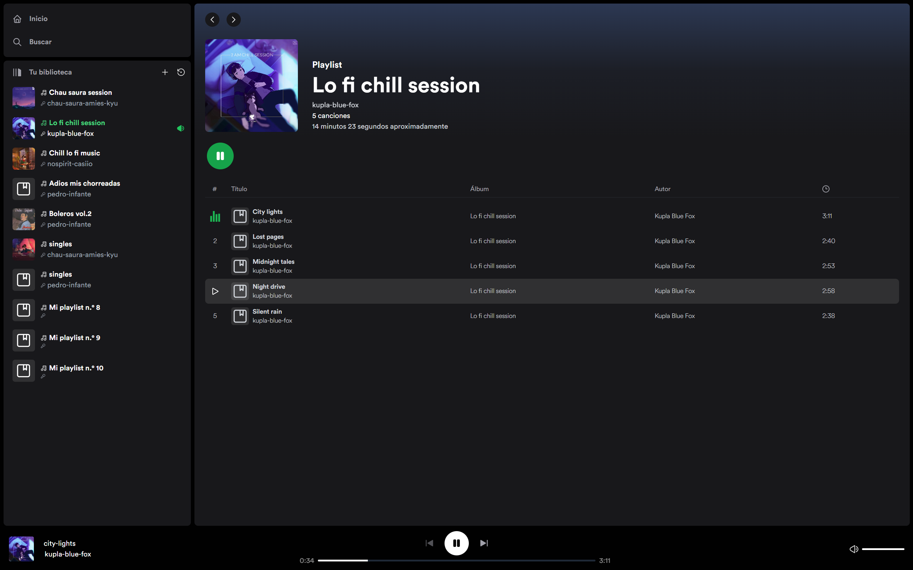
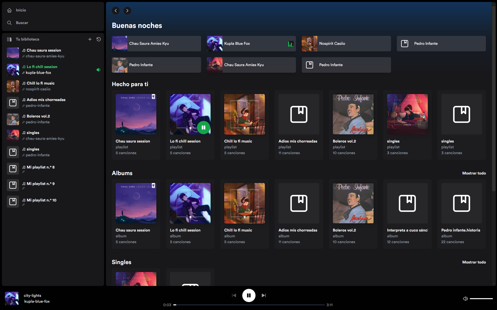

# Spotify Clone

Este es un emocionante proyecto de clonación de Spotify 

Prueba la aplicación en [Vercel](https://spotify-clone-two-flax.vercel.app/).

## Descripción

Este proyecto consiste en un clon de la popular aplicación de música, Spotify. Se ha desarrollado con el propósito de aprender y practicar las tecnologías más modernas y relevantes del desarrollo web.

## Tecnologías Utilizadas

- **JavaScript:** El lenguaje principal de programación utilizado en el proyecto.
- **React:** Una biblioteca de JavaScript para construir interfaces de usuario.
- **Git y GitHub:** Herramientas fundamentales para el control de versiones y colaboración en el desarrollo de software.
- **Astro:** Un marco moderno para la creación de aplicaciones web.
- **Zustand:** Una biblioteca de gestión de estado para React.
- **TailwindCSS:** Un marco de trabajo de diseño CSS utilizable y escalable.
- **Vite:** Un constructor de proyectos web rápido y flexible.
- **TypeScript:** Un superconjunto tipado de JavaScript que se compila en JavaScript.
- **ESLint:** Una herramienta de análisis de código estático para identificar problemas en el código JavaScript.
- **Node.js:** Un entorno de ejecución de JavaScript para el desarrollo de aplicaciones del lado del servidor.
- **API Routes de Astro:** Para la comunicación con el servidor y la obtención de datos.
- **Extracción de datos de archivos mp3:** Proceso para acceder y utilizar la música almacenada en la carpeta `public`.

## Comunicación

Para la comunicación con el servidor, se implementa una API REST que proporciona acceso a una variedad de datos, incluyendo canciones, álbumes, artistas y listas de reproducción.

## Diseño

El diseño de la aplicación está inspirado en la interfaz intuitiva y atractiva de la aplicación oficial de Spotify, asegurando una experiencia de usuario familiar y agradable. Además, se ha asegurado de que la interfaz sea completamente receptiva, adaptándose a diferentes dispositivos y tamaños de pantalla.

## Funcionalidades Destacadas

- Al ser pocas canciones he optado por no utilizar una base de datos, sino que he optado por almacenar las canciones en la carpeta `public/musics` y obtener los datos de las canciones utilizando Node.js.
- También se usa el modo Hybrid de Astro, PAra generar paginas estaticas cuando sea neceario, y obtener las canciones usando el servidos cuando sea necesario.
- Reproducción de canciones
- Obtención de datos utilizando Node.js
- Búsqueda de canciones utilizando Fuse.js
- Control de volumen
- Reproducción y pausa de canciones
- Avance rápido y retroceso en la reproducción de canciones
- Reproducción automática de la siguiente canción
- Gestión de la línea de tiempo de la canción
- Navegación hacia atrás y hacia adelante utilizando el historial del navegador
- Restablecimiento de datos
- Agregado de nuevos playlists
- Control de Volumen con teclado

> [!NOTE]
Al estar alojado los archivos .mp3 en vercel free, tiene limitaciones en cuanto al tiempo de reproducción, por lo que la reproducción de las canciones puede ser interrumpida.
Del mismo modo la restauración de datos ni la creación de nuevas listas de reproducción,
al estas usar el file system de Node.js, no se puede realizar en vercel, por lo que estas funcionalidades no estarán disponibles en la versión alojada en vercel.

En el repositorio esta disponibles los scripts que se usa para hacer esta extracción.

## Hosting

La aplicación está alojada en Vercel, asegurando un rendimiento óptimo y una disponibilidad constante.

¡No dudes en explorar el código y experimentar con esta emocionante clonación de Spotify!

Este proyecto fue creado por  [Niels Olivera Zurita](https://github.com/NielsOzDev).

¡Dale un vistazo al repositorio en [GitHub](https://github.com/NielsOzDev/spotify-clone) para explorar más sobre este emocionante proyecto!
